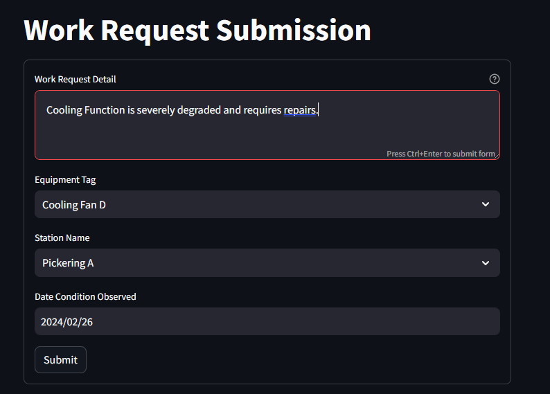
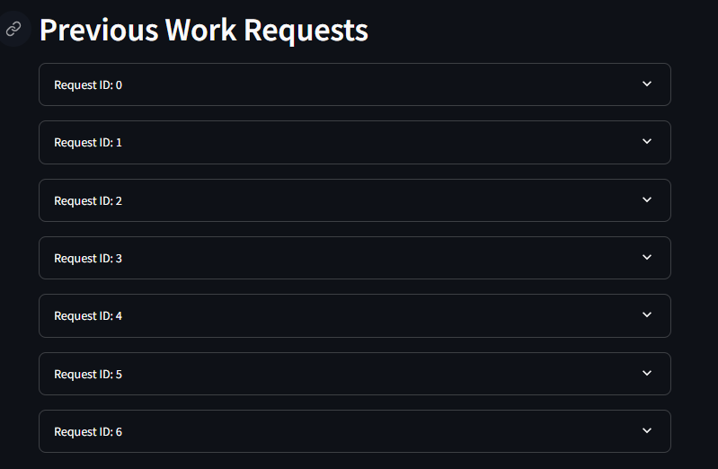
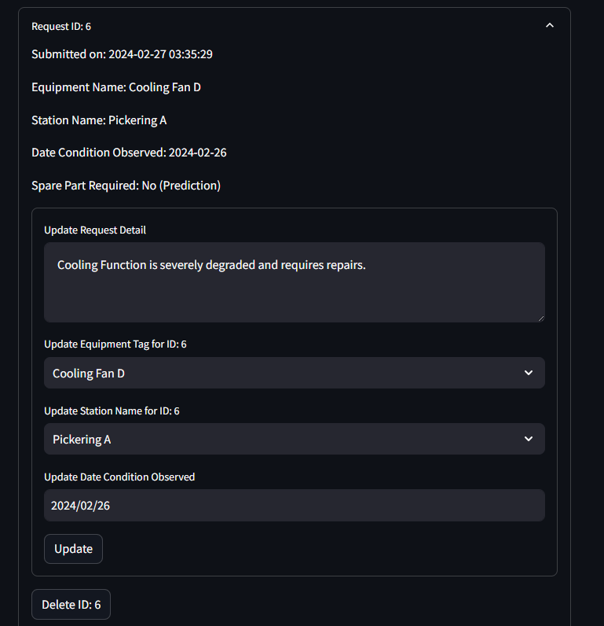

# Work Request Intake System

### Developed by Muhammad Anwar and Daniel Lau for ENGM4620 Project # 1

## Description
The Work Request Intake System is a project that aims to streamline the process of submitting and managing work requests within an organization. It provides a user-friendly interface for users to submit work requests, update their attributes, and also generate a prediction of whether a spare part will be required.

## Features
- Work request submission form
- View previously submitted work requests
- Modify attibutes of previously submitted work requests
- Generate a prediction for whether spare parts are going to be required for the work being requested
- Ability to modify the work request details to re-generate prediction for spare parts

## How to run

Note: This has been tested with Python 3.10.11 only

### First create a virtual environment:

#### Using Venv:
```
python -m venv .workreq
.workreq\Scripts\activate.bat
pip install -r requirements.txt
```

### Next initialize the sqlite database
```
python init_db.py
```
Note: This populates the database with some sample work requests for demonstration purpose.

### Run the streamlit application -- the app will be launched automatically in a browser
```
streamlit run main.py
```

### Additionally launch test for pattern analyzer
```
python .\text_pattern_analyzer_test.py
```

Desired output of the test script is:

```
Negative Examples: Matched 0/10
Positive Examples: Matched 10/10
Ran 2 tests in 0.003s
OK
```

## Usage

* Go to http://localhost:8501 
* Create a new Work Request submission by filling out the form and hitting 'Submit' button

* View previously submitted work requests under the section "Previous Work Requests" as shown below:

* To update previously submitted work request, expand the accordion. This allows to modify any previously submitted work request attributes or delete the work request as shown below:

* The 'Spare Part Required' is predicted as Yes or No through pattern matching. This prediction is updated for an existing work request any time the 'Request Details' are updated. 

## Improvement Opportunities

* Instead of pattern matching, other NLP techniques can be experimented with to predict whether spare parts are needed
* Work Request can also be evaluated for urgency and given an urgency or priority score based on that
* Large Language Models (LLM) can be used to analyze the work request and extract key pieces of information


## Contact
For any inquiries or support, please contact the author team at [this email](mailto:saleh.anwar@gmail.com).
